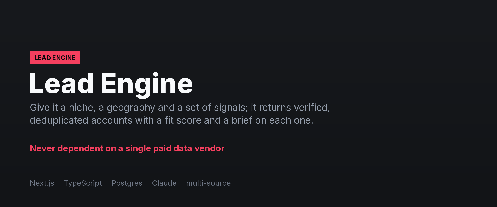
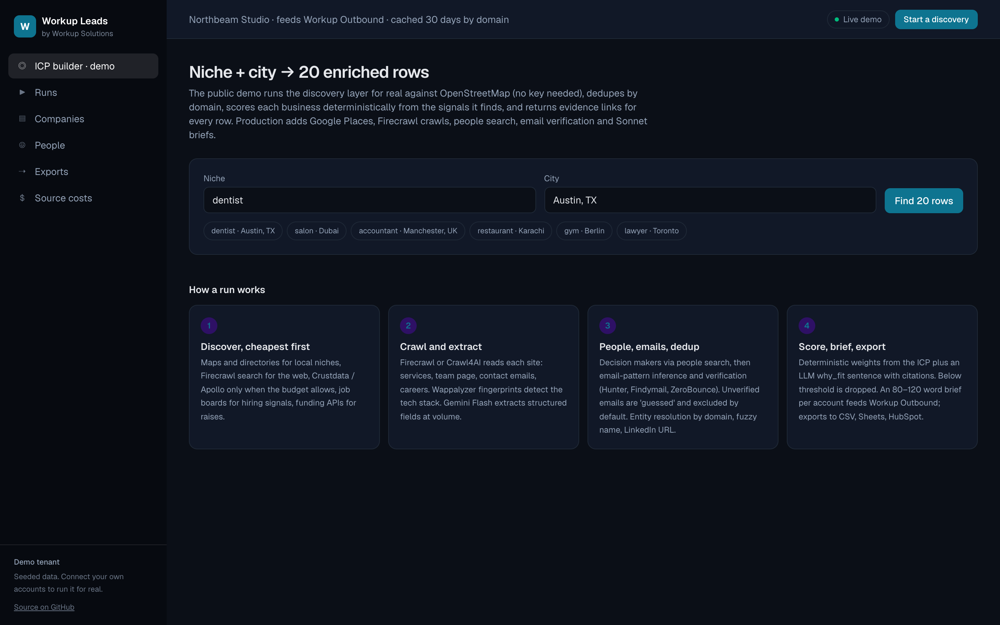

**[← All systems](https://github.com/musabqazi)** · [Voice Receptionist](https://github.com/musabqazi/voice-receptionist) · [Outbound Engine](https://github.com/musabqazi/outbound-engine) · [WhatsApp Agent](https://github.com/musabqazi/whatsapp-agent)

# Lead Engine — lead scraping and enrichment engine

Give it a niche, a geography and a set of signals; it returns a verified, deduplicated, enriched
list of companies and decision makers with a fit score and a one-paragraph brief per account,
ready for Outbound Engine or for direct delivery. Sources prospects without depending on a
single paid data vendor.

real rows from OpenStreetMap with evidence links and a deterministic fit score, no API key
needed. **Spec:** [SPEC.md](SPEC.md)

**Source:** private, available on request

## Dashboard

The discovery view: verified, deduplicated accounts with a fit score and a one-paragraph brief on each.

## The problem

List building is slow and expensive, lists are stale, and there are no signals. Agencies,
recruiters and sales teams export by hand or pay per seat.

## What it does

1. **Discover, cheapest first.** OSM and Google Places for local niches, Firecrawl search for
   the web, Crustdata / Apollo only when the budget allows, job boards for hiring, funding APIs.
   ([lib/discover.ts](lib/discover.ts) is the OSM layer the demo runs.)
2. **Crawl and extract.** Firecrawl / Crawl4AI read each site — services, team, emails, careers.
   Wappalyzer fingerprints detect the stack. Gemini Flash extracts structured fields at volume.
3. **People, emails, dedup.** People search, then email-pattern inference and verification
   (Hunter, Findymail, ZeroBounce). Unverified emails are exported as `guessed` and excluded by
   default. Entity resolution by domain, fuzzy name and LinkedIn URL.
4. **Score, brief, export.** Deterministic weights from the ICP plus an LLM `why_fit` with
   citations; below threshold is dropped. 80–120-word briefs feed Outbound's research step.
   CSV, Sheets, HubSpot, or direct campaign push.

## Rules it never breaks

Never fabricate an email. Every signal has an evidence URL. robots.txt and per-domain rate limits
respected. No login-gated scraping. Crawls cached and reused for 30 days.

## Stack

   

## A note on what you can see here

Screenshots in this repository use **seeded demo data** — a fictional tenant and synthetic records throughout. No client data appears in this repository, and the implementation is private.

---
Part of the <a href="https://github.com/musabqazi">musabqazi portfolio</a> · source private. © 2026 Musab Qazi
